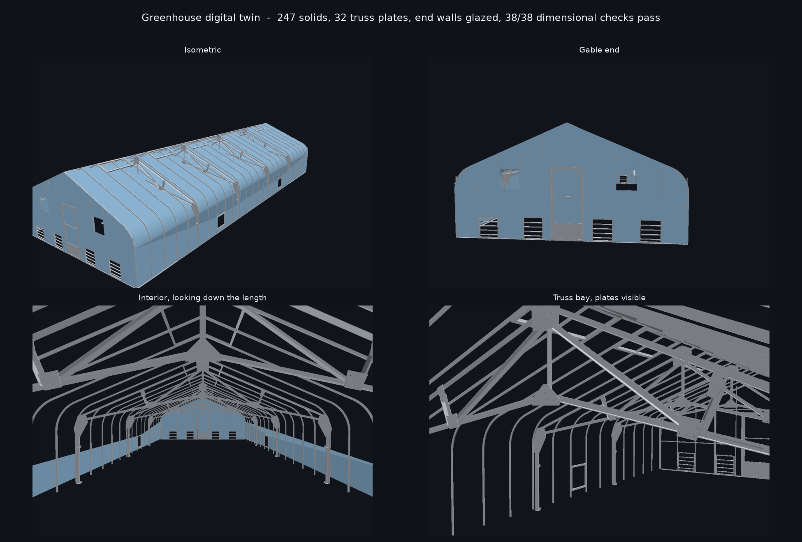
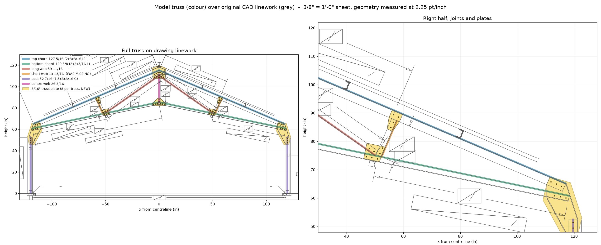

# Greenhouse Digital Twin

Curved-eave gable greenhouse, **20'-6¼" W × 51'-3¼" L × 10'-2⅞" to top of ridge**,
23.1° roof pitch, four interior trusses. Parametric and dimension-accurate, built as a
starting point for interior fit-out — trusses and cross members, lighting, growth tables,
suspended plant supports, germination tent.

**248 solids** — 241 frame, 7 glazing. **38/38 dimensional checks pass, 0 failures across
all five check families.**

**[▶ Open the interactive 3D viewer](https://jorinhakai.github.io/hakai-greenhouse-model/)**

Or open [`greenhouse_viewer.html`](greenhouse_viewer.html) directly — one self-contained
file, no side-car assets, works from disk or hosted.



---

## Files

| File | What it is |
|---|---|
| `greenhouse.step` | **The master model.** ISO-10303 STEP, solid B-rep, millimetres. Opens editable in FreeCAD, Fusion, SolidWorks, Rhino, Onshape, Inventor. Import into SketchUp/Blender from here. |
| `greenhouse.glb` | glTF binary, millimetres, **Y-up** — web, Sketchfab, Blender, Unity/Unreal. |
| `greenhouse_web.glb` | Same but undrilled; under a third the size, used by the viewer. |
| `greenhouse_viewer.html` | Self-contained viewer, geometry embedded. Also copied to `index.html`. |
| `frame.stl` / `glazing.stl` | Meshes, if you just want to look or 3D print. |
| `gh_geometry.py` | **Every dimension, with the sheet it came from.** Edit here to change the building. |
| `gh_plates.py` | Truss plate outlines, bolt patterns and placements (generated). |
| `gh_build.py` | Assembles the members and exports STEP/GLB/STL. |
| `gh_verify.py` | Re-runs every check against the drawing values. |
| `gh_viewer.py` | Wraps the built GLB into the self-contained viewer. |
| `gh_preview.py` | Renders the inspection views above. |
| `gh_overlay.py` | Draws the model truss over the original CAD linework. |
| `extract_truss.py`, `extract_plates.py`, `place_plates.py`, `extract_gable.py`, `pdf_extract.py` | The measurement tools (need the source drawings). |
| `verification_report.json`, `manifest.json` | Machine-readable check results and member counts. |

### Rebuilding

```bash
python gh_build.py --noholes    # fast; also writes greenhouse_web.glb
python gh_build.py              # master model, all 248 bolt holes drilled
python gh_verify.py             # all five check families
python gh_viewer.py             # regenerate the viewer from the GLB
python gh_preview.py            # regenerate the inspection views
```

Needs `cadquery`, `trimesh`, `pymupdf`, `numpy`, `matplotlib`.

> `gh_verify.py` and `gh_geometry.py` may print a segfault *after* their output.
> That is an OCP/OpenCascade teardown crash at interpreter exit, after all work is
> done and all files are written. Results are unaffected.

---

## Source material is deliberately not in this repo

`.gitignore` excludes the vendor CAD set, the site photographs, and the rendered
drawing sheets in `_ref/`. The drawing title blocks carry the model number, the
customer name and the manufacturer, so those files stay local. Put the CAD set
at `drawings_source.pdf` if you need to re-run the measurement tools; nothing in
the build or the viewer depends on it.

---

## Coordinate system

- `x = 0` building centreline across the **width**; ±123.125" to the glazing outer face
- `y = 0` top of foundation / floor slab; `+y` up
- `z = 0` one gable end; `+z` along the **length** to 615.25"
- STEP units are **millimetres**; all source dimensions in `gh_geometry.py` are **inches**

---

## The truss

Each of the four trusses is a fan truss: two top chords, two sloping bottom chords,
one centre web on the centreline, and a long + short web per half. **Five webs per
truss**, tied by **eight 3/16" aluminium plates**.

| Member | Length | Section |
|---|---|---|
| Top chord | 127 5/16" | 2" × 3" × 3/16" angle |
| Bottom chord | 120 3/8" | 2" × 2" × 3/16" angle |
| Centre web | 26 3/16" | 2" × 2" × 3/16" angle |
| Long web | 59 11/16" | 2" × 2" × 3/16" angle |
| Short web | 13 13/16" | 2" × 2" × 3/16" angle |
| Truss post | 52 7/16" | 1½" × 3" × 3/16" channel |
| Purlin, ridge, gable post | — | 1½" × 3" × 3/16" channel |
| Post cleats | — | 2" × 3" × 3/16" angle |
| Gable horizontal brace | 148½" and 104 13/16" | 1" × 2" × 1/8" channel |
| Gable purlin support | 107 3/8" | 2" × 2" × 3/16" angle |
| Side-wall horizontal brace | — | 1" × ¾" angle |

### The plates

Recovered from the sheet's own `3/16" TRUSS PLATES` detail box, then located by matching
each plate's 3/8" bolt pattern against the same pattern drawn in place on the truss
elevation. Every plate fitted at **scale 1.000, RMS ≤ 0.02"** — which is the check that
the detail box is drawn at elevation scale, and hence that the outline sizes are true.

| Plate | × | Size | Holes | Subtotal |
|---|---|---|---|---|
| Knee | 2 | 13.63 × 21.97" | 9 | 18 |
| Trapezoid, short-web top | 2 | 5.52 × 7.60" | 4 | 8 |
| Square, mid joint | 2 | 7.72 × 6.69" | 7 | 14 |
| Wide triangle, king-post base | 1 | 12.56 × 7.17" | 8 | 8 |
| Peak | 1 | 12.51 × 12.16" | 12 (+2 to ridge) | 12 |
| | | | | **60** |

60 is exactly the fastener table's *"Plates: 3/8" × 1¼" Bolt & Nut (60)"*, and the 2
extra holes in the peak plate are its separate *"Peak Plate → Ridge (2)"* line. That
tally is independent corroboration of the whole extraction.

Outlines are convex hulls of the drawn outline. The drawn plates are convex **except**
for a small notch at the apex of the peak plate, which the hull closes — that is the one
place a plate is not shape-exact.

---

## The viewer

Light theme by default, dark on a toggle (remembered in `localStorage`, or press
<kbd>L</kbd>). Six view presets, frame/glazing/edges/grid toggles, and the member list.

Spin controls, because orbiting a 51-foot building needs more than drag:

| | |
|---|---|
| <kbd>←</kbd> <kbd>→</kbd> or ◀ ▶ | step 30° around the building |
| <kbd>↑</kbd> <kbd>↓</kbd> | tilt |
| <kbd>space</kbd> | auto-rotate — about the vertical axis (walk around it) or about the long axis (roll), with a speed slider |
| <kbd>[</kbd> <kbd>]</kbd> | roll about the long axis by hand |
| <kbd>1</kbd>–<kbd>6</kbd> | view presets · <kbd>R</kbd> reset |

The camera is clamped away from both poles (`minPolarAngle` / `maxPolarAngle`). At a pole
the azimuth is degenerate and horizontal dragging stops responding, which is what made
spinning feel stuck — the old Plan preset placed the camera exactly there.

---

## The GLB export was standing the building on its end

**CadQuery's GLB export was standing the building on its end.** CadQuery assumes models
are authored Z-up and writes a −90° rotation about X on the glTF root node to reach
glTF's Y-up convention. This model is authored **Y-up already** (`y` is height throughout
`gh_geometry.py`), so that rotation put the 615" length on the vertical axis: the GLB
measured 6.26 × 15.63 × 3.12 m instead of 6.26 × 3.12 × 15.63 m.

Every glTF consumer honours the node transform, so `greenhouse.glb` was on its side in
Blender, Sketchfab and Unity too — not just the viewer. `fix_glb_up()` in `gh_build.py`
strips the rotation from the exported file, which is where the fix belongs. The STEP and
STL exports were never affected.

The viewer additionally checks the extents it measures after applying node transforms
against the GLB's raw accessor bounds, and re-orients if they disagree. The three extents
are all distinct, so the mapping is unambiguous. That guard means a future exporter change
cannot silently break it again — this bug produced no error, just a building lying down.

---

## What changed in v4

The v3 model was dimensionally accurate but had real topology errors. All of these are
now fixed and guarded by checks.

1. **Removed 24 members that floated in mid-air.** Three "purlin support" members per
   half-truss had been digitised from stray linework; `PSUP_A` sat at y≈56" where the
   bottom chord is at y≈72" — 16" clear of anything it was supposed to connect to. The
   drawings punch the purlins straight through the top chord
   (*"PUNCH FOR PURLIN (3/8")"*), so no such member exists.
2. **Added the 13 13/16" short web**, 2 per truss, missing entirely. The truss had 3
   webs where the drawing calls for 5.
3. **Split the lower gable horizontal brace.** It was one full-width member running
   straight through the doorway. The drawings show **two** braces of 104 13/16" each,
   running inward from ±121.133" and stopping at ±16.320" — they bolt to the door jambs
   and do not cross the opening.
4. **Added the 8 truss plates per truss** (32 solids) at true 3/16" thickness, with all
   248 bolt holes drilled in the master model.
5. **Added the gable purlin support**, 107 3/8" of 2×2×3/16 angle up each rake.
6. **Corrected the upper gable brace section** to 1×2×1/8 channel (was 2×2 angle).
7. **Added post cleats**, base and side-wall, 4 per truss.
8. **Glazed the end walls, and added glass doors.** The roof/side skin is the envelope
   extruded along the length, so it is a tube open at both ends — each gable was a bare
   frame with no glazing at all. Each end now carries a glazing pane with the door frame,
   the four intake shutters and (far end) the two exhaust fan holes cut out of it.

   The door is a single glazed leaf per end, measured off the sheet-2 frame elevation:
   2" stiles and top/bottom rails, a solid kick panel at the foot, then two equal 27.17"
   glazed lights split by a thin mid rail at 46.000–47.013". The drawing hatches the kick
   panel with diagonals — the solid-material hatch — not the dots-and-triangles pattern it
   uses for concrete on the foundation, so it is a panel rather than a step.

   The old model had a "door mid rail" spanning the full frame width at half the opening
   height, which matched neither the height nor the width of the real rail; the leaf's own
   rails replace it.
9. **Purlin positions left alone.** Worth recording as a non-change: the truss sheet's
   *"PUNCH FOR PURLIN"* stations (42¾" / 86¼") are measured from a different origin than
   the top-chord apex. The side-wall elevation independently puts the purlin bands at
   98.09–101.42" and 80.97–84.33", which the existing centres reproduce to **0.035"**,
   whereas the punch stations would move them 2.7". Anchored to the elevation.

---

## How the model is checked

`gh_verify.py` runs four families. The connectivity family is the one that matters most:
no dimensional check could ever have caught the floating members, because each of them
was individually the right length.

| Family | What it asserts |
|---|---|
| **A. Dimensions** | 38 modelled lengths and positions against stated drawing values. |
| **B. Connectivity** | Every truss member end must be held by *something* — another member within 3.5", a plate that covers it, or the foundation. Anything else is floating. |
| **C. Clearance** | No structural member may cross a door opening, and none may span the centreline at door height. |
| **D. Plates** | Every plate must sit on a real joint and reach the members meeting there. |
| **E. End walls** | Both ends glazed, the door leaf fits its opening and its elements tile the full leaf height with no gap, and the door / shutter / fan openings are **really cut** — tested against the built mesh, not against the intent. |

Current state: **38/38 dimensional checks pass, 0 failures across all five families,
no floating member ends.**

### Selected dimensional results

| Check | Model | Drawing | Delta |
|---|---|---|---|
| Overall width | 246.2500 | 246.2500 | +0.0000 |
| Overall length | 615.2500 | 615.2500 | +0.0000 |
| Top of ridge | 122.8750 | 122.8750 | +0.0000 |
| Roof pitch (deg) | 23.1000 | 23.1000 | +0.0000 |
| Interior truss width | 236.2500 | 236.2500 | +0.0000 |
| Top chord length | 127.2936 | 127.3125 | −0.0189 |
| Bottom chord length | 120.3878 | 120.3750 | +0.0128 |
| Centre web length | 26.1860 | 26.1875 | −0.0015 |
| Long web length | 59.7032 | 59.6875 | +0.0157 |
| Short web length | 13.8376 | 13.8125 | +0.0251 |
| Lower gable brace length | 104.8130 | 104.8125 | +0.0005 |
| Gable purlin support length | 107.3914 | 107.3750 | +0.0164 |
| Door clear opening width | 32.3730 | 32.3730 | +0.0000 |
| Door lower light height | 27.1730 | 27.1730 | +0.0000 |
| Door upper light height | 27.1740 | 27.1740 | +0.0000 |
| Plate bolt holes per truss | 62 | 62 | 0 |

Every member is within **0.03"** of its stated length. Full table in
`verification_report.json`.



---

## How the dimensions were obtained

The supplied CAD set is **vector**, not scanned — real text and real linework. Rather
than reading the drawings by eye, the extract scripts pull both out programmatically.

1. **Scale calibration.** Dimension-line spans initially appeared inconsistent
   (2.2121–2.2136 pt/in). Differencing three independent spans on one sheet
   (236.25", 242.25", 246.25") gives **exactly 2.25 pt/inch** — 3/8"=1'-0" at 72 dpi —
   with a **constant 8.96 pt arrowhead inset**. That inset reproduces all three spans to
   0.00 pt, and non-dimension geometry linework then measures true at 2.25 pt/in.
2. **Geometry read directly.** Member positions, depths, opening sizes and the eave
   curve were measured off the actual linework, then cross-checked against the stated
   dimensions.
3. **Watch the `qu` items.** Two of the eight truss plates are drawn as PDF *quad*
   paths rather than polylines, and the extractor silently missed them until the bolt
   tally refused to reach 60. If you extend the extraction, handle `l`, `c`, `re` **and**
   `qu`.

### Cross-checks that came out consistent

- **Eave curve.** Solved by tangency (vertical wall at ±123.125", rafter through the
  ridge at 23.1°, bend point 52.0") → **R = 27.788"**, centre (95.337, 52.0). Offsetting
  that curve 2.83" inboard reproduces the measured structural line: roof height at x=0
  comes out 119.80" against a drawing value of 119.80".
- **Length chain.** 1⅜" + 25 × 24½" + 1⅜" = 615¼" closes exactly (26 glazing-bar stations).
- **Width layering.** Interior truss 236.25" + 3" post each side = exterior truss
  242.25"; + 2" side-wall glazing each side = overall 246.25". All three stated values
  reconcile.
- **Gable post position.** 74⅛" from outside base + 98" post-to-post + 74⅛" = 246.25".
- **Plate bolt tally.** 60 + 2, matching the fastener table exactly.
